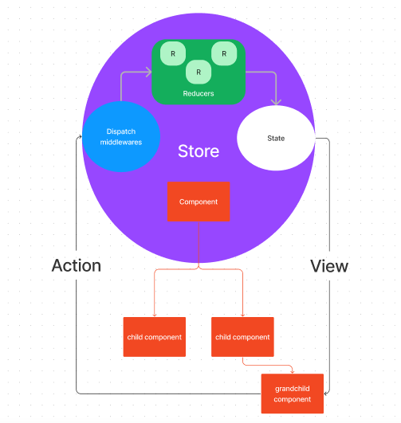

This is a [Next.js](https://nextjs.org/) project 

## Getting Started

First, run the development server:

```bash
npm run dev
# or
yarn dev
```

Open [http://localhost:3000](http://localhost:3000) with your browser to see the result.


## Architecture

</br>

- ./pages  - where u can see the pages render

- ./redux - where is the redux logic located

</br>

## How is it works ?

</br>

1 - First you need to configure the "store"

2 - "store": is a function that receives an object. This object contains the reducers that will contain the "slicers", u can check on ./redux/store.ts

3- Don't forget to wrap the entire application in a provider and pass the store as a property, check on ./pages/_app.tsx

4- "slicers": are also a function that receives an object in which it should have the initial state, and the functions that change this state, check on ./redux/slicers/counterSlice.ts

5- After that the component will need to import the useDispatch hook that will execute the action of executing the slicer action. In addition to using the useSelector hook that allows you to extract data from the Redux store state to display the initial state, check on ./pages/index.tsx

</br>


## The concept

</br>

I made a sketch of the redux flow for me to understand the concept that it works

</br>



